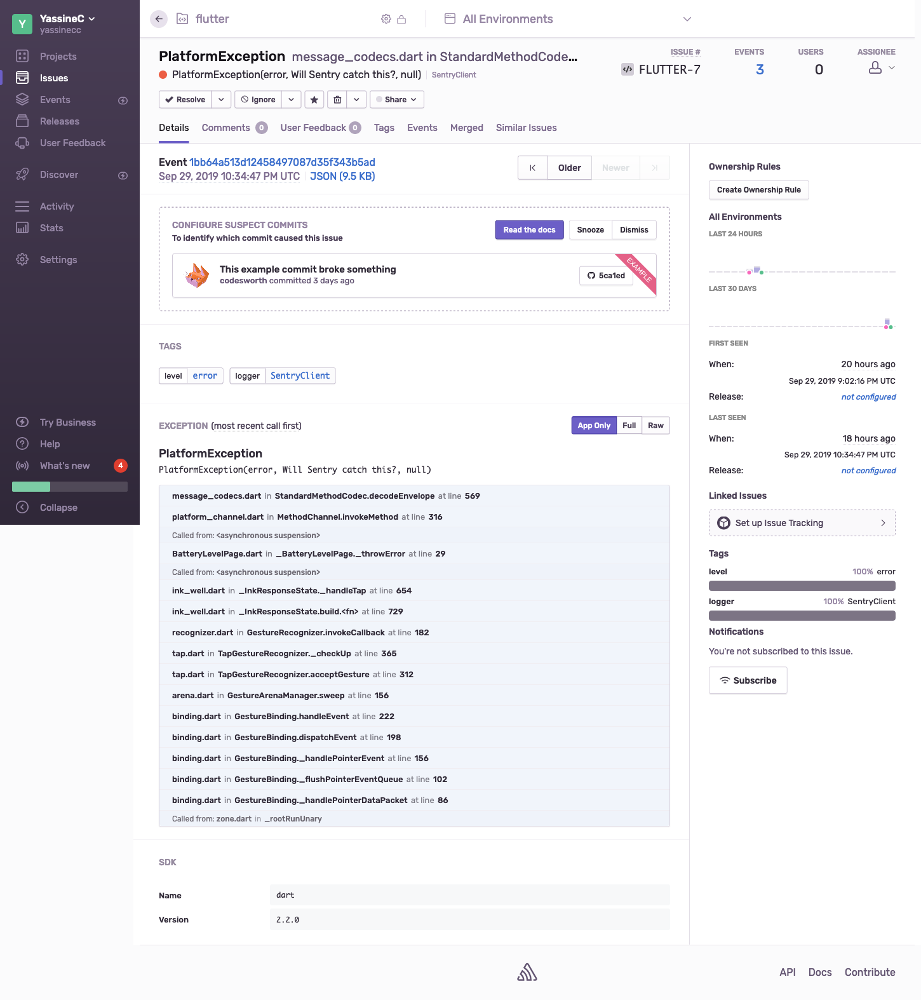

# Crash reporting for Flutter apps

## Purpose

Flutter has been gaining traction in the mobile dev community and has been lauded for its animation capabilities uses Dart for cross-platform app development. It went from being a playground framework to a seriously considered option for production apps. How does Flutter stand in terms of industrial standards for app development and exploitation?

## Crash reporting at a glance

When an app starts its life on the app stores, the most critical events that negatively affects the app's quality are its crashes. As you reach for a high quality standard, you need equally reliable ways to:

* count crashes;
* collect helpful details to diagnose them;

Tools such as Sentry and Crashlytics have become a golden standard for native and cross platform apps, as they:

* provide detailed stack traces at the different app software layers (native, UI code...)
* aggregate crashes data in easy-to-visualize ways

Let's see if we can reach these objectives with Flutter

## General setup

Native errors get sent to Sentry as well, although with a less detailed stacktrace that a thrown `FlutterError`

It is possible to get both Sentry and Crashlytics running within your app, they can be used the following way:

* Wrap your app around a Zone, which is basically a try/catch block that catches uncaught asynchronous errors
* In the runZoned call, pass your errorHandler which will report all app errors to your reporting service

The end result should look like this:

```diff
// In your main.dart file
+ import 'package:flutter/services.dart';

/* Some imports and code */

-void main() => runApp(MyApp())
+void main() async {
+   runZoned<Future<void>>(() async {
+   runApp(MyApp());
+ }, onError: (error, stackTrace) {/* Handle your error here */});
```

### Sentry

The Flutter team has provided an excellent guide on how to setup Sentry on your app [here](https://flutter.dev/docs/cookbook/maintenance/error-reporting) . You can easily setup crash reporting to Sentry with a Dart HTTP Sentry client that has been developed by the Flutter team themselves.

* Get a DSN from sentry.io
* Follow the guide mentioned above to create the zone and initialize / call the Sentry service

You should see something like this on your Sentry dashboard. Notice that Sentry by default reports events as errors.



### Crashlytics

1- Setup Firebase Analytics on your project (only native dependencies are OK if you only plan to use Crashlytics)

2- Install the native Crashlytics dependencies

3- Contrary to other platforms, you will need to explicitly report errors to Crashlytics. Follow the example here

You should now be able to see in your Flutter console errors reported to both services. Do note that the first Crashlytics errors may take 24 hours to appear on your dashboard

#### Note

When running in dev mode or using a Zone, Flutter catches all kinds of errors and does not let the app crash. That's why handling errors Flutter-side will only log non-fatal errors. This is an [ongoing issue](https://github.com/flutter/flutter/issues/29689) in the official Flutter Crashlytics plugin, although it is possible to force a crash if you use the [non-official Crashlytics plugin](https://pub.dev/packages/flutter_crashlytics) through the `forceCrash` option

## TLDR

* You can use both Sentry and Crashlytics to report errors from your Flutter projects
* Both of these need manual error reporting in your Dart code
* A limitation of the Crashlytics SDKs prevents systematic differentiation of fatal and non-fatal crashes
* Native stack traces are not transmitted to the Dart error handlers
